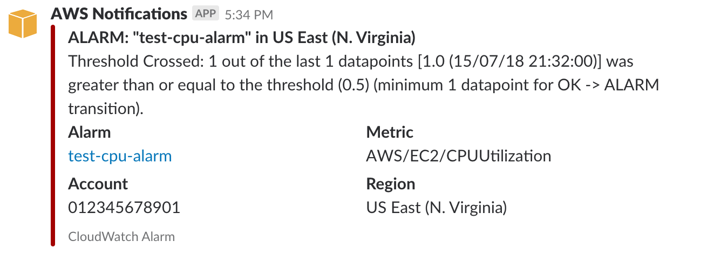

# AWS Slack Alerts

Lambda function to send AWS alerts to a Slack channel. This function was originally developed by me while working at
[Morris Technology](http://www.morristechnology.com) ([@morris-tech](https://github.com/morris-tech)). We wanted to know
when instances in an auto scaling group were launched/terminated, when a CloudWatch alarm was triggered, and when an
AWS health event occurred. It has native support for those three scenarios, but should (more or less) support any
messages sent to SNS or CloudWatch events triggered.

## Deployment
You can easily deploy this function to your account using [Serverless](https://serverless.com/)
(refer to their website for information on how to install Serverless):

### Get API token
In order to communicate with Slack, you need to setup an API token. This is easiest done by creating a Slack app on
your Slack team until I am able to distribute an app publicly.

### Deploy function

Install the function locally:

```
sls install -u https://github.com/MichaelPalmer1/aws-slack-alerts/
```

Switch into the `aws-slack-alerts` folder and deploy the function:

```
sls deploy --token=<Your Slack Token> --channel='#channel'
```

### Configure SNS Topic

Serverless will create a SNS topic named `notify-slack`. Simply configure your auto scaling groups and CloudWatch alarms
to send messages to that topic.

## Sample Notifications

### Auto Scaling Launch


### Auto Scaling Termination


### Alarm Triggered


### Alarm OK


### Health Event

